# Screenshots

This document contains proof of all the important screenshots of the application, including setup, features, and outputs.

---

## **1. Clone the Project**

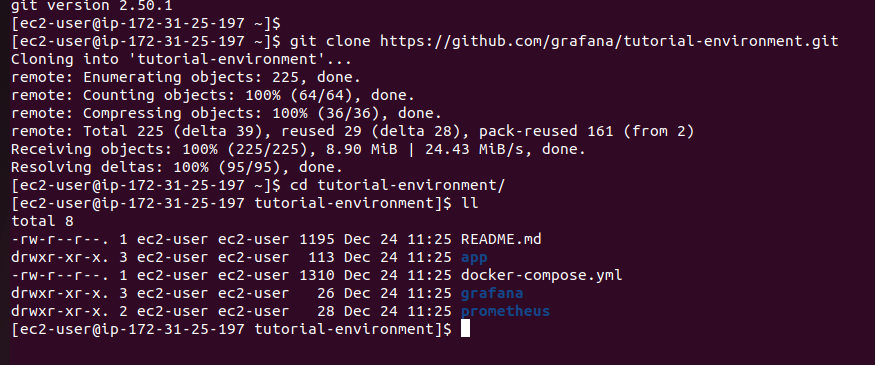

---

## **2. Run the Containers**

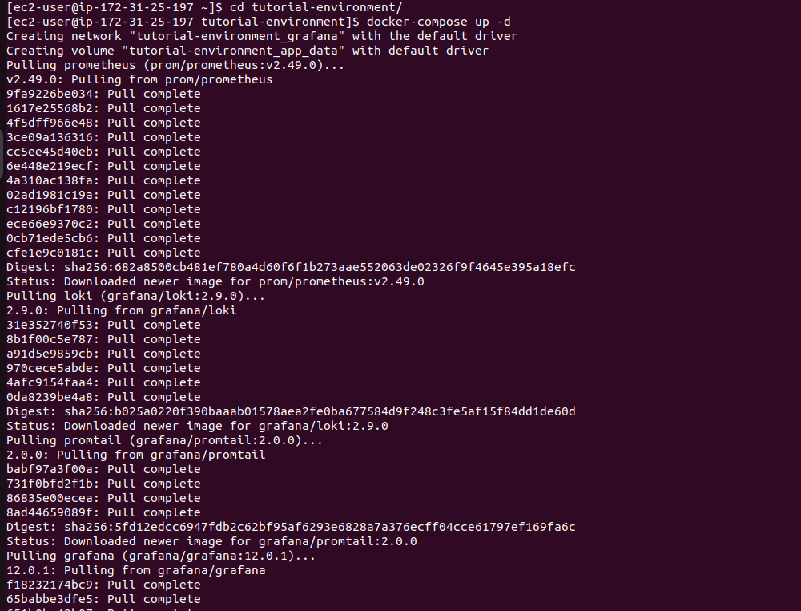
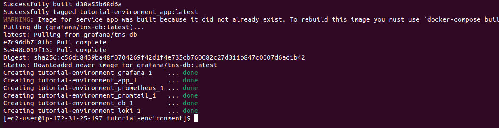

---

## **3. Verify the running Containers**

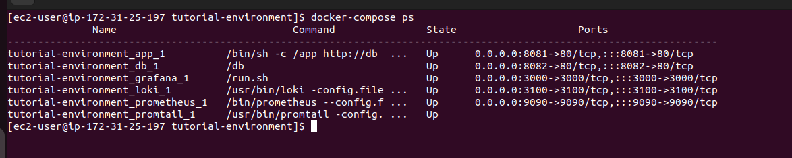

---

## **4. Access the Application on port 8081**

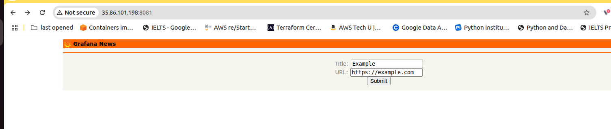
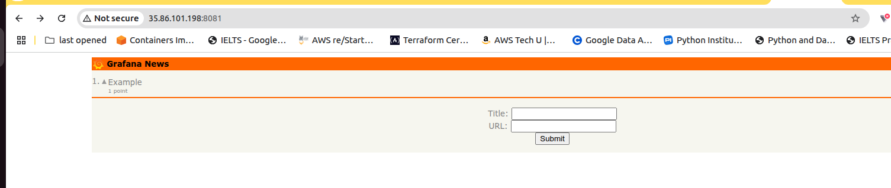
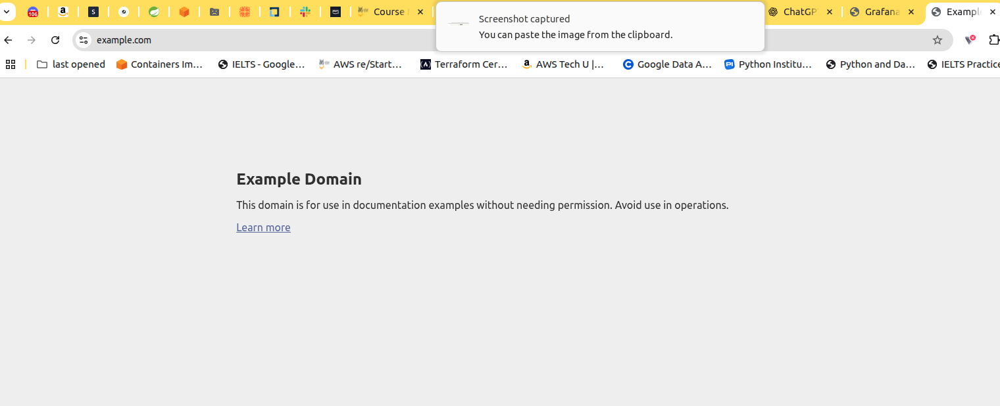

---

## **5. Access Grafana on port 3000**

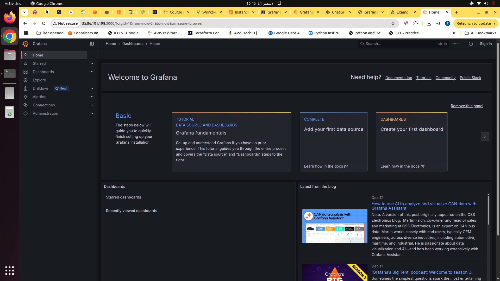
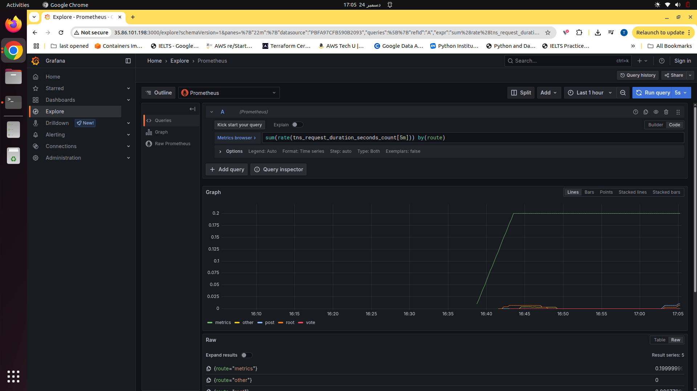
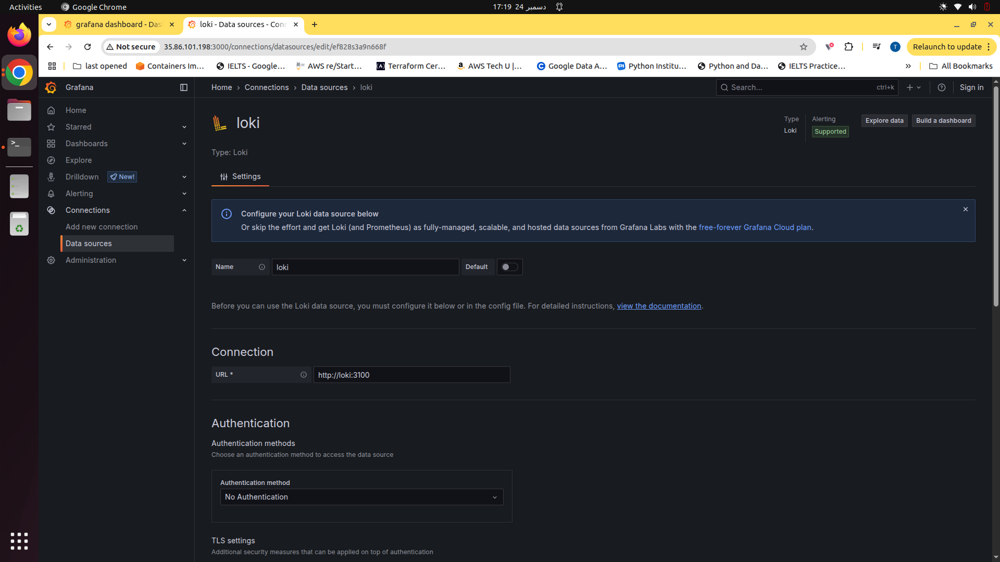
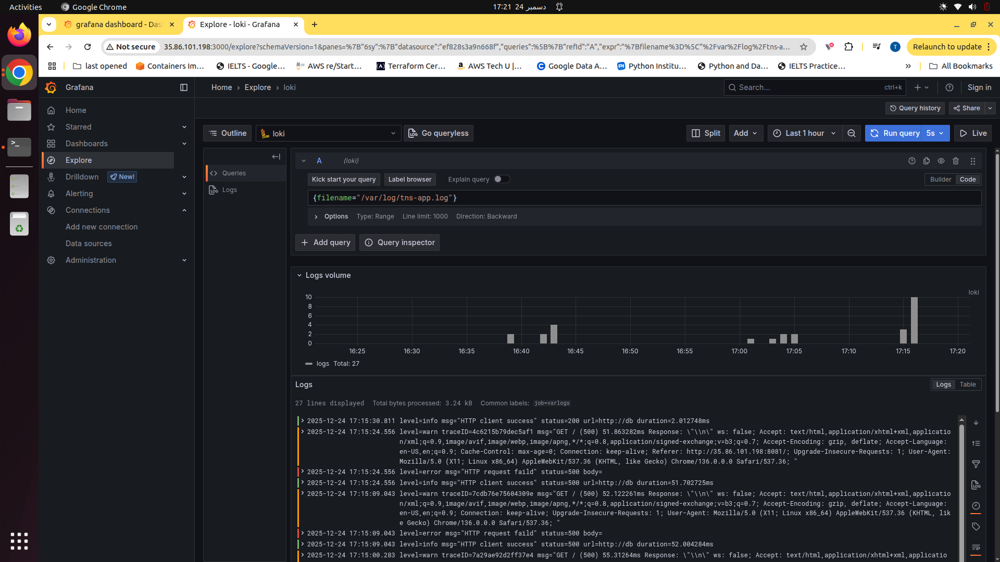

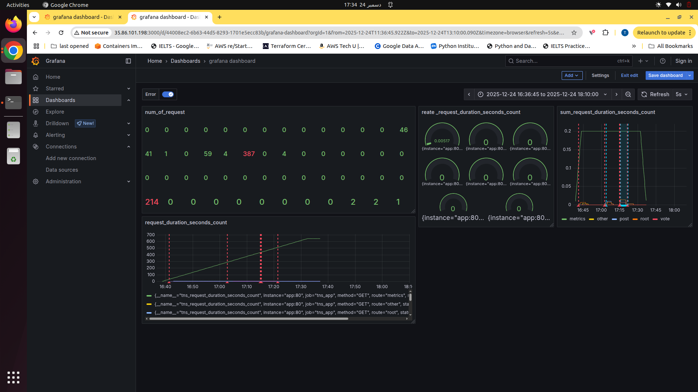
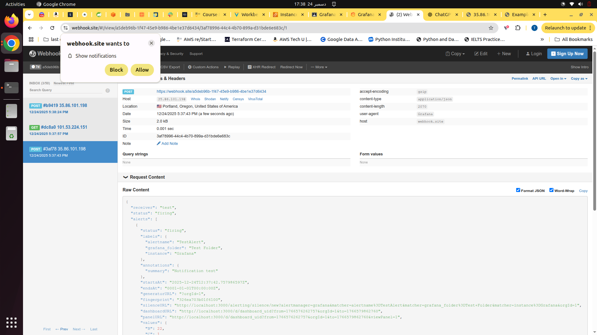

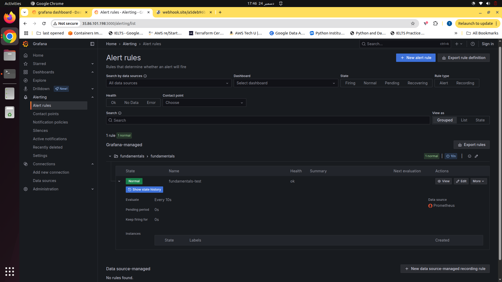

---

## **6. Stop the container at the end**

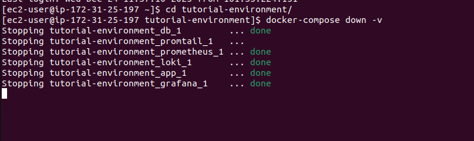

---
